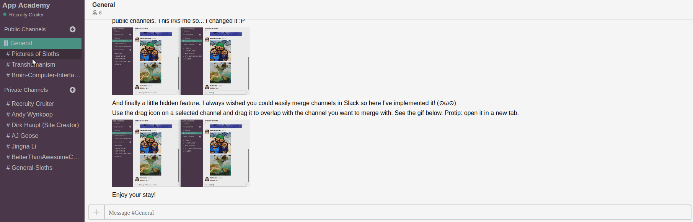

### Check out the [Live Site](https://app-academy-sloth.herokuapp.com/#/)!

## Technologies

* Ruby on Rails
* React
* Redux
* Websockets (ActionCable)
* AWS S3
* jQuery

I'm a huge fan of [Slack](https://slack.com/). In fact, I'm such a huge fan of Slack that I replaced Evernote with it and believe there is untapped potential in reworking Slack workspaces such that they are designed as "**S**earchable **L**ogs of **A**ll **C**onversation and **K**nowledge" for an individual and their personal life instead of just for enterprise teams. So I have here set about building the core feature set of the site (Live Chat, User Authentication, Channels, Private Channels) with a bit of a redesign with focus placed more on the individual rather than the team as the primary audience. One feature in particular I wish existed for my personal day-to-day Slack use is a one-click solution to Channel and Workspace merging/unmerging so I have set about implementing the initial stages of what this might look like.

Also, I like Sloths. And apparently [so does the team at Slack.com](https://twitter.com/lynnmuffin/status/682846610833846272)

## Notable Features 

### 1. Live Chat using ActionCable websockets
### 2. Instant Image updating from file upload using AWS S3


Sloth utilizes [ActionCable](https://guides.rubyonrails.org/action_cable_overview.html)'s underlying websockets to establish two-way communication between server and client chat, allowing for both the site's live chat and live image sharing.

* Before our MessageForm component mounts we create the socket and subscribe the chat channel to the open connection. We make use of a custom-made create method to handle form data being sent to the open connection.

```javascript
  componentWillMount() {
    this.createSocket();
  }

  createSocket() {
    let cable;
    if (process.env.NODE_ENV !== 'production') {
      cable = ActionCable.createConsumer('http://localhost:3000/cable');
    } else {
      cable = ActionCable.createConsumer('wss://app-academy-sloth.herokuapp.com/cable');
    }
    this.chats = cable.subscriptions.create({
      channel: 'ChatChannel'
    }, {
      connected: () => {},
      received: (data) => {
        this.props.newMessage(data)
      },
        create: function (chatContent, authorId, channelId) {
          this.perform("create", {
            content: chatContent,
            author_id: authorId,
            channel_id: channelId
          });
      },
    });
  }
```

* Our rails ChatMessage controller will recieve the data sent to the open connection. ActionCable will then update the client instantly once the controller completes creating a new message. To upload to our S3 bucket we encapsulate our image file in a formData object and process it via an ajax request. As soon as the client receives the newly created image url the message_list component re-renders and scrolls the new image into view.

```javascript
  handleSendEvent(event) {
    event.preventDefault();

    if(this.state.currentChatMessage) {
      this.chats.create(
        this.state.currentChatMessage,
        this.props.currentUser.id,
        this.props.channel.id);
      this.setState({
        currentChatMessage: ''
      });
    }

    if (this.state.imageFile) {
      let formData = new FormData();
      formData.append("message[photo]", this.state.imageFile);
      formData.append("message[channel_id]", this.props.channel.id);
      $.ajax({
        url: '/api/messages',
        method: 'POST',
        data: formData,
        contentType: false,
        processData: false
      }).then((res) => {
        this.props.history.push("/channels/" + res.message.channel_id); 
      });
      this.setState({ imageUrl: "", imageFile: null });
      document.getElementById("message-form-hidden-file-upload").value = null;
    }
  }
```


## 3. Private Channels and a search bar for adding users to private channels. 

Private Channels have protected routes and are functionally identical to direct messaging/group messaging. The search updates users in real-time and channels are given default names if none is provided. 

I decided not to differentiate between "direct message channels" and "private channels". If you think about it they are functionally equivalent and as a daily Slack user differentiating direct message channels from private channels means I can have a private channel hidden among a whole list of public channels. This irks me so... I changed it.

## 4. Bonus: Channel Merging



[React-draggable](https://www.npmjs.com/package/react-draggable) is used so that any channel can be dragged when selected. The selected channel can then be dragged and dropped on top of any other channel (regardless of whether the other channel is private or not). This opens the merge modal where a name can be given to the new merged-channel and it can be decided whether the new channel is private or public. The merged channel has all messages from the other two channels duplicated. The idea being that a user can delete the old channels if they so choose.

The hardest part was - to my surprise - handling the drag-and-drop behaviour of React-draggable. Ultimately I resorted to manually tweaking html attributes in the modal constructor to find the attribute that was dropped on (i.e. channel to be merged with). From here since channel names are unique it is relatively straightforward to merge two channels given two channel names.

```javascript
    componentWillMount() {
        this.toMergeWithChannel = document.elementFromPoint(0, this.draggedChannelY);
        this.props.fetchMessages();
        this.props.fetchChannels();
        this.props.fetchUserChannels();
    }

    constructor(props) {
        super(props);
        this.draggedChannel = document.getElementsByClassName("react-draggable-dragged")[0];
        this.draggedChannelY = this.draggedChannel.getBoundingClientRect().y;
        this.draggedChannel.style.webkitTransform = "translate(0px, 0px)"
        this.draggedChannel.style.transform = "translate(0px, 0px)";
        this.state = {
            newChannelName: '',
            mergedChannelIsPublic: true,
        };
        this.handleMergeChannelsSubmit = this.handleMergeChannelsSubmit.bind(this);
    }
``` 

## Future Plans

1. Workspaces (i.e. an individual's repository of knowledge)
2. Workspace merging (i.e. when you meet someone interesting who has their own workspace and you want to collaborate and selectively share particular notes and chat on particular topics you would Merge Workspaces)
3. Workspace unmerging 
4. Channel unmerging
5. Message/Channel/Workspace deletion
